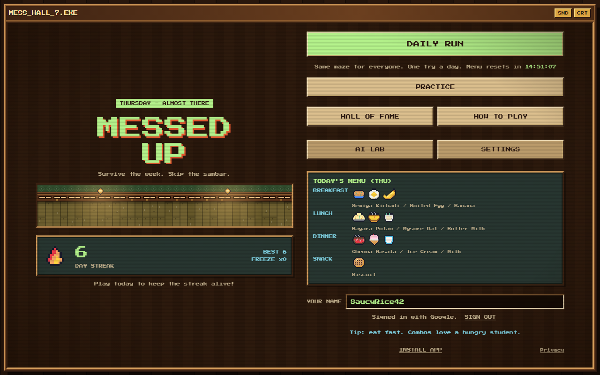
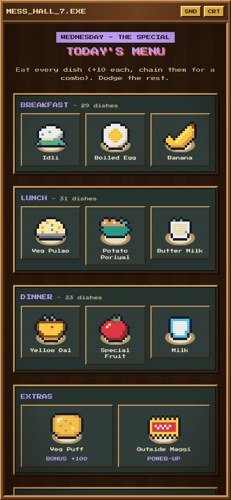
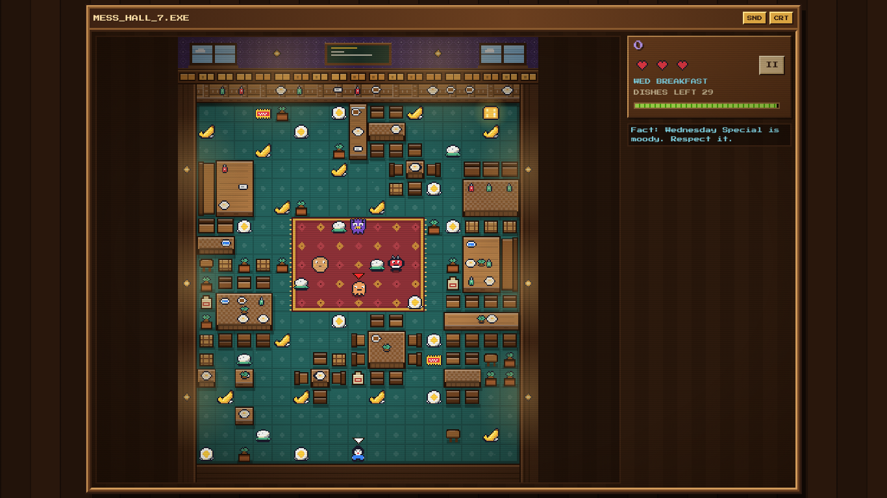
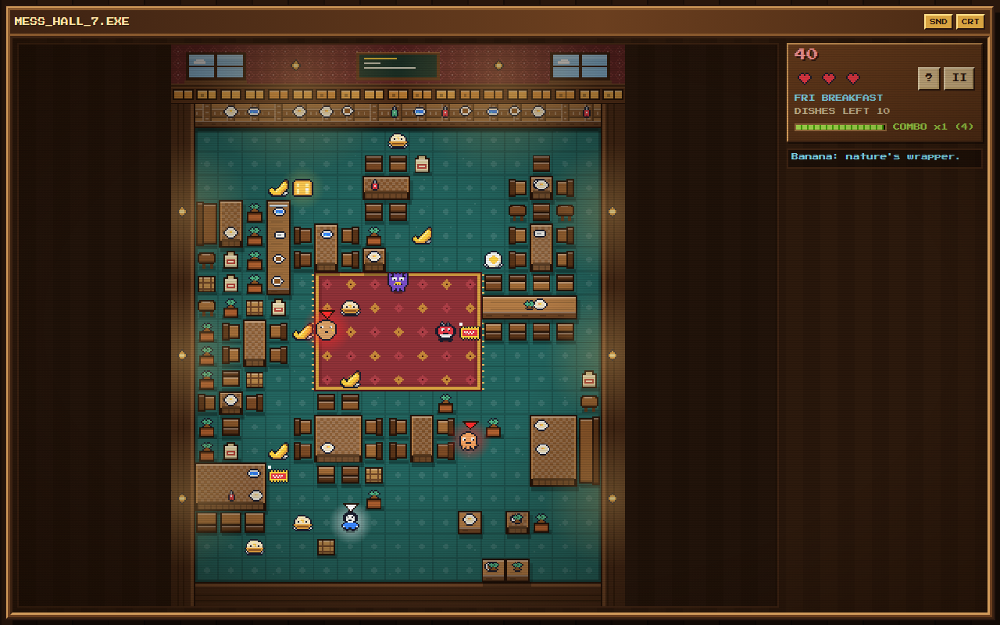

# MESSED UP

**Survive the week. Skip the sambar.**

A retro pixel-art maze game about a hungry hostel student. Eat the day's mess menu, dodge the dishes that chase you, escape through the exit, and come back tomorrow for the Daily Run. It runs in any modern browser, on phones, tablets and desktops, with no install. Practice is open to everyone; sign in with Google to play the ranked Daily Run.

**Play it:** https://messed-up-game.vercel.app



## Contents

- [Features](#features)
- [Tech stack](#tech-stack)
- [Getting started](#getting-started)
- [How to play](#how-to-play)
- [Game AI](#game-ai)
- [Architecture](#architecture)
- [Testing](#testing)
- [Deployment and CI/CD](#deployment-and-cicd)
- [Accounts and ranked play](#accounts-and-ranked-play)
- [Known limitations](#known-limitations)
- [Credits](#credits)

## Features

- **Daily Run**: one ranked attempt per Google account per day (IST), the same secret mazes for everyone, with streaks and Streak Freezes.
- **Server-verified scores**: the server replays each run's inputs through the same deterministic simulation and records the score that replay produces. Scores sent by the client are never trusted.
- **Practice mode**: any weekday, random maze, unlimited tries, adaptive difficulty.
- **Seven days, seven themes**: each weekday has its own menu, enemy line-up, difficulty and dining-hall look, from gentle Monday to brutal Sunday.
- **Easy / Normal / Hard**: scale enemy speed, number of dishes, lives and score multiplier. Scores are normalised so Daily ranks stay comparable.
- **Procedurally generated dining hall**: furniture-based layouts that are always connected and free of dead-end traps.
- **Game AI**: A* chasers, an ambusher, a wanderer, a finite-state-machine boss, adaptive difficulty and a bot playtester. See [Game AI](#game-ai).
- **Responsive, no-scroll UI**: every menu page is laid out in columns and scaled to fit the screen, so nothing scrolls. In-game, the maze and HUD rearrange for portrait and landscape.
- **Touch, keyboard and swipe controls**, with a large on-screen d-pad whose position can be switched for one-handed play.
- **First-run guided tour** in the game screen that points out the player, enemies, dishes, exit and HUD. It can be skipped, and replayed from the `?` button.
- **Accessibility and comfort options**: high contrast, clear font, three text sizes, reduced motion, CRT effect toggle, vibration toggle, adjustable volume.
- **Community leaderboard**: today, all-time and best streaks, with unique moderated nicknames, backed by Upstash Redis.
- **Tiny footprint**: no image or audio files. Art is defined as text and drawn to canvas, sound is synthesised with WebAudio. The production JavaScript bundle is about 100 kB (37 kB gzipped).

## Tech stack

| Area | Choice |
|---|---|
| Language | TypeScript (strict) |
| Rendering | HTML5 Canvas 2D, pre-rendered sprites and an offscreen static layer |
| Build / dev server | Vite |
| Tests | Vitest |
| Audio | WebAudio synthesiser |
| Backend | One Vercel Function (bundled from `server/`) plus Upstash Redis (REST) |
| Sign-in | Google Identity Services; ID tokens verified on the server, no auth library |
| Hosting | Vercel |
| CI/CD | GitHub Actions |

## Getting started

Requires **Node.js 22** (the version CI uses) or newer.

```bash
git clone https://github.com/Divyan-H/messed-up-game.git
cd messed-up-game
npm ci
npm run dev:api    # local API on :8787 (in-memory Redis unless Upstash env vars are set)
npm run dev        # http://localhost:5173 (proxies /api to the local API)
```

Practice works with `npm run dev` alone. Real Google sign-in works locally once `http://localhost:5173` is an authorised JavaScript origin of the OAuth client.

### Scripts

| Command | Description |
|---|---|
| `npm run dev` | Start the Vite dev server |
| `npm run dev:api` | Start the local API server (see above) |
| `npm run build` | Typecheck, build the site to `dist/` and the API to `api/game.js` |
| `npm run build:api` | Rebuild only the API bundle `api/game.js` (commit the result) |
| `npm run serve:prod` | Pre-deploy check: serve `dist/` with the production security headers and the real API bundle |
| `npm run preview` | Serve the production build locally |
| `npm run typecheck` | Run the TypeScript compiler without emitting |
| `npm test` | Run the unit tests |
| `npm run playtest [n]` | Headless bot plays `n` runs per weekday and prints clear rates |
| `npm run snapshot` | Render PNG frames with the real renderer into `./snapshots` |
| `npm run foodsheet` | Render a labelled contact sheet of every dish sprite |
| `npm run admin -- <command>` | Moderate the live leaderboard (see [Moderation](#moderation)) |

### URL flags (Practice only)

The ranked Daily Run ignores these.

| Flag | Effect |
|---|---|
| `/?autopilot` | The bot plays the game (good for demos) |
| `/?autopilot&sim=4` | Same, with the simulation running 4x faster |

## How to play

**Goal:** eat every dish to open the exit, then reach it. A day has three courses: Breakfast, Lunch and Dinner.

**Controls:** arrow keys or WASD, swipe on the maze, or the on-screen pad. `P` or `Esc` pauses. You keep moving in your chosen direction until you turn.

| Thing | Rule |
|---|---|
| Lives | Start with 3 stomachs (Easy: 4). Touching a chaser costs one. |
| Hunger | A hunger bar drains over time and refills when you eat. At zero you lose a stomach. |
| Points | Dish +10 (combo up to x5), bonus snack +100, clear bonus for time and remaining stomachs. |
| Outside Maggi | A power-up that scares every chaser. Eat them for 200, 400, 800 and 1600. |
| Warden | Stop eating for too long and the Warden appears and hunts you. |
| Perks | After each course, choose 1 of 3 (speed, extra stomach, longer Maggi, longer combo, see enemy paths). |
| Daily Run | Sign in with Google. One ranked attempt per account per IST day, on any device. The attempt is used when you press START; if you leave mid-run, what you played so far is submitted. |
| Streaks | +1 per day played. Every 7th day earns a Streak Freeze (max 2) that forgives one missed day. |
| Practice | Unlimited, any weekday, random maze, adaptive difficulty, no streak or ranking. |

### Difficulty

Each weekday gets harder (more and faster enemies, quicker releases). On top of that you can choose a level in **Settings** or on the menu card:

| Level | Effect | Score |
|---|---|---|
| Easy | Slower enemies, fewer dishes, 4 stomachs, longer Maggi, no boss | x0.6 |
| Normal | The intended experience | x1 |
| Hard | Faster enemies, more dishes, quicker releases, shorter Maggi, hungrier player | x1.2 |

The multipliers were tuned with the bot so no level is the obvious choice for ranking: average scores are close across levels, and Hard has the highest ceiling. Everyone gets the same layout for the day; the level is part of the run configuration, so replays stay deterministic. In the Daily Run, enemy paths are only shown by the Hostel Hack perk.




## Game AI

The game is built around classic game-AI techniques.

| Module | Technique | Code |
|---|---|---|
| Chaser (Sambar Blob) | **A\*** with a Manhattan heuristic on a binary min-heap | `src/game/pathfinding.ts`, `src/game/enemies.ts` |
| Ambusher (Mystery Curry) | Target prediction: aims several tiles ahead of the player's heading | `src/game/enemies.ts` |
| Wanderer (Chapati Ghost) | Stochastic movement from a seeded RNG | `src/game/enemies.ts` |
| Boss (Wednesday Special) | **Finite state machine**, PATROL and CHASE with hysteresis. All enemies share DEN, ACTIVE, SCARED and EATEN modes | `src/game/enemies.ts` |
| Level generation | **Procedural content generation**: furniture sets placed by constrained rejection sampling, a flood-fill connectivity check, and dead-end and trap-pocket removal using **Tarjan's articulation points** | `src/game/furniture.ts`, `src/game/maze.ts` |
| Adaptive difficulty | **Dynamic difficulty adjustment**: an exponential moving average of player performance scales enemy speed in Practice (Daily stays fixed so rankings are fair) | `src/game/difficulty.ts` |
| Bot playtester | Danger-weighted **Dijkstra** agent used to measure balance without human testers | `src/game/bot.ts`, `scripts/playtest.ts` |
| Determinism | Fixed 60 Hz simulation and a seeded RNG: the same inputs always produce the same run, and `replayRun` verifies it | `src/game/run.ts` |

The in-game **AI Lab** screen exposes these live: a pathfinding benchmark (A\* vs Dijkstra vs BFS), a bot playtest, a record-and-replay determinism check and the adaptive-difficulty state. A "Show enemy paths" setting draws every enemy's planned A\* route over the maze.

To get current balance numbers after any tuning change, run:

```bash
npm run playtest 20
```



## Architecture

```
src/
  core/      Pure utilities: seeded RNG, IST clock, min-heap, safe storage
  game/      The simulation. No DOM, no Math.random, no wall-clock time
             config, menu, maze (PCG), pathfinding, mover, enemies (AI),
             stage, run, perks, difficulty, bot
  render/    Canvas renderer, text-defined pixel art, hall painter, particles
  audio/     WebAudio synthesiser (no audio files)
  services/  Account (signed-in player), API client, streak rules, nickname rules,
             profile (local settings and practice stats), leaderboard reads
  ui/        App shell, screens, game view, input, layout and fit engine, tour, Google button
server/      The API: Google token check, sessions, Daily start/finish with replay
             verification, leaderboards, moderation, rate limits (bundled into api/)
api/         game.js: the generated Vercel Function (do not edit; run npm run build:api)
public/      privacy.html
tests/       Unit and API tests
scripts/     Local API server, admin tool, headless playtest, PNG snapshot tools
```

Key design decisions:

- **Simulation is separate from presentation.** `src/game` runs headless, which is what makes bot playtesting, unit tests and replays possible. The UI only reads state and consumes an event queue.
- **Fixed timestep (60 Hz) with a free-running renderer.** Behaviour is identical on 60, 120 and 144 Hz screens and on slow phones.
- **Cheap rendering.** The dining hall is drawn once to an offscreen canvas, sprites are pre-rendered, particles are pooled and the HUD only touches the DOM when a value changes.
- **Fit-to-screen menu pages.** `src/ui/layout.ts` lays each menu page out at several candidate widths, picks the one that scales up best for the viewport, and applies a uniform scale. Wide screens show every card at once; portrait phones get tabs. In-game overlays shrink instead of scrolling.
- **Server-authoritative ranked play.** The server owns the date, the daily maze seed (derived from a secret), the one-attempt lock, streaks and scores. The client only sends inputs.
- **One function, no runtime dependencies.** `server/` and the simulation are bundled into a single ES module, so the deployed function has nothing to install and the server replays runs with exactly the code the browser ran.
- **Patterns used.** Strategy (enemy behaviours), state machines (enemy modes, run phases), an event queue between simulation and UI, observer (account changes re-draw the title screen).

## Testing

```bash
npm test
```

The suite covers the seeded RNG and heap, pathfinding optimality and equivalence, maze and furniture guarantees (connectivity, no dead-end traps, clear aisles), enemy behaviour, run determinism and replay, streak rules, the difficulty model, profile sanitisation, layout and fit calculations, and sprite and menu coverage.

The API tests (`tests/server.test.ts`) run the real handler against an in-memory Redis and RSA-signed test tokens: sign-in and every token rejection case, CSRF and rate limits, nickname rules, the one-attempt lock, replay-verified scoring of full and quit runs (played by the bot), forged scores, too-fast submissions, expiry, streaks across days, and leaderboard caching rules. The same suite runs in CI on every push and pull request.

## Deployment and CI/CD

The site is deployed on Vercel. A GitHub Actions workflow (`.github/workflows/deploy.yml`) handles both checks and deployment:

| Event | What runs |
|---|---|
| Pull request to `main` | Typecheck, tests, production build, and a check that `api/game.js` matches its source |
| Push to `main` | The same checks, then a production deploy to Vercel |

So merging or pushing to `main` updates the live site automatically.

### Setup for your own fork

1. Create a Vercel project for the repository and link it locally with `npx vercel link`. The IDs are then in `.vercel/project.json`.
2. Create a token at https://vercel.com/account/tokens.
3. Add these repository secrets (Settings, Secrets and variables, Actions):

   | Secret | Value |
   |---|---|
   | `VERCEL_TOKEN` | The token from step 2 |
   | `VERCEL_ORG_ID` | `orgId` from `.vercel/project.json` |
   | `VERCEL_PROJECT_ID` | `projectId` from `.vercel/project.json` |

4. Push to `main`.

Routing for the API, security headers (including a strict Content Security Policy) and long-lived asset caching are configured in `vercel.json`. GitHub Actions are pinned to commit SHAs and the Vercel CLI to a fixed version.

## Accounts and ranked play

Practice needs nothing. The Daily Run, streaks and the leaderboard need two one-time setup steps.

### Setup

1. **Google sign-in.** In the Google Cloud console, create an OAuth client of type *Web application* and add the site's origins (for example `https://messed-up-game.vercel.app` and `http://localhost:5173`) as **Authorised JavaScript origins**. The client ID is in `src/services/authConfig.ts` (it is public by design); override it on the server with `GOOGLE_CLIENT_ID` if needed.
2. **Database.** In the Vercel project, add the **Upstash Redis** integration from the Marketplace. It injects `UPSTASH_REDIS_REST_URL` and `UPSTASH_REDIS_REST_TOKEN` (`KV_REST_API_URL` / `KV_REST_API_TOKEN` also work). Pick the same region as the function: it runs in Mumbai (`bom1`, set in `vercel.json`). Redeploy afterwards.
3. *Optional:* set `SESSION_SECRET` to a long random string. Without it, a key is derived from the Redis token.

Until the database is connected the API answers `503`, and the game shows "Ranked play is offline" while Practice keeps working.

### How it works

| Endpoint | Purpose |
|---|---|
| `GET /api/me` | Current player (or none), server time and today's status |
| `PATCH /api/me` | Change nickname (unique, moderated, rate-limited) |
| `POST /api/auth` / `DELETE /api/auth` | Sign in with a Google ID token / sign out |
| `POST /api/daily/start` | Use today's attempt and receive the day's maze seed |
| `POST /api/daily/finish` | Submit the run's inputs; the server replays them and records the score |
| `GET /api/leaderboard?board=daily\|alltime\|streak` | Top 20, cached at the CDN for 30 seconds |

- The Google ID token's signature, issuer, audience and expiry are checked against Google's published keys. Only Google's numeric account ID is stored, never email, name or photo.
- Sessions are a signed, HttpOnly, Secure, SameSite cookie; state-changing requests must be same-origin JSON (CSRF protection).
- One attempt per account per day is enforced with a Redis lock, using the server's date. The daily seed is an HMAC of the date, so future mazes cannot be computed in advance.
- A submitted run is rejected if it claims more play time than has actually passed since it started, and it is scored only by replaying its inputs.
- Leaving mid-run submits what was played (and retries on the next visit if the network failed), so a refresh never silently loses the attempt.

### Moderation

Nicknames are checked against a blocklist that sees through leetspeak and separators. To act on the live data, connect Upstash, run `npx vercel env pull .env.local --environment=production` once (the file is git-ignored), then:

```bash
npm run admin -- top daily
npm run admin -- rename <nickname> <new-name>
npm run admin -- ban <nickname>
```

`ban` removes the player from every board and blocks ranked play; `unban` reverses it.

### Capacity on the free tiers

Gameplay runs entirely in the browser, so the number of simultaneous players is not limited by the server. Each ranked player costs roughly 10-15 Redis commands per day; Upstash's free tier (500,000 commands a month) therefore covers on the order of 1,000 daily ranked players, and Vercel's Hobby plan (1,000,000 requests and function invocations a month) about 10,000. Beyond that, Upstash pay-as-you-go costs about $0.20 per 100,000 commands. Hobby is for non-commercial use.

## Known limitations

- **One person, several Google accounts.** Each account gets its own Daily attempt. That takes real effort, but it is not prevented.
- **Bots playing in real time.** A custom program that plays through the browser at real speed produces valid input logs. The built-in autopilot is disabled for ranked runs, and runs cannot be submitted faster than real time.
- **Sessions are stateless.** Signing out clears the cookie; a stolen cookie would stay valid until it expires (30 days) unless `SESSION_SECRET` is changed, which signs everyone out.
- **Data deletion is manual** (see `public/privacy.html`).
- Audio is synthesised and has not been covered by automated checks.

## Credits

Mess menu data adapted from the SRM IST hostel mess menu (w.e.f. 23.03.2026). All art is original pixel art generated from text in `src/render/art.ts` and related files. The pixel font is [Press Start 2P](https://fonts.google.com/specimen/Press+Start+2P) via Fontsource.
